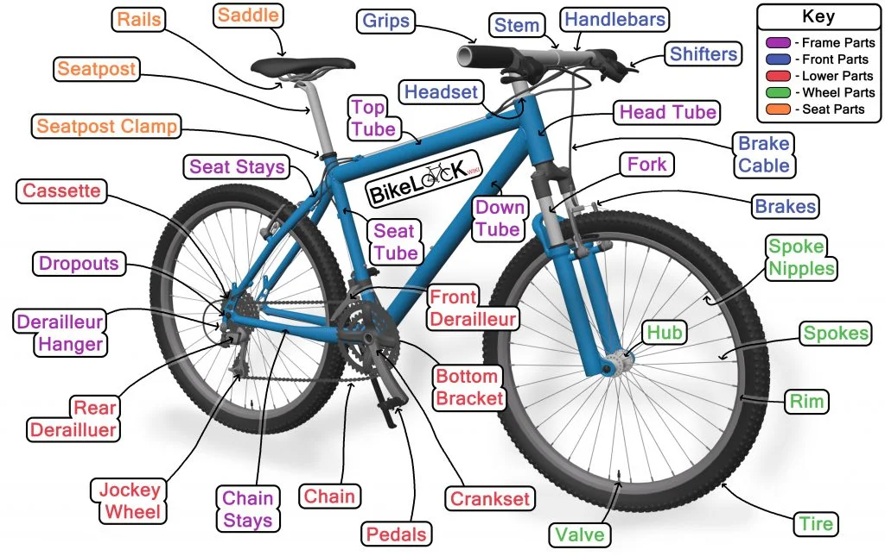
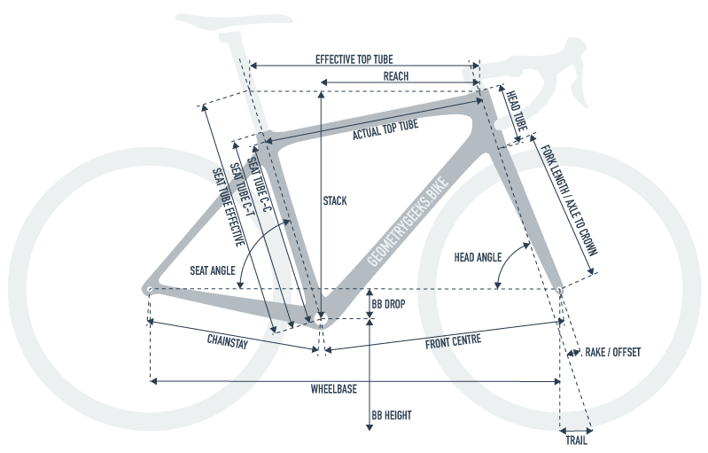
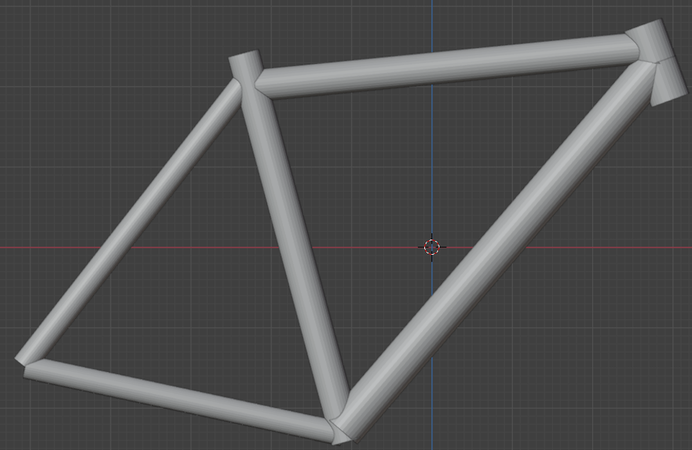
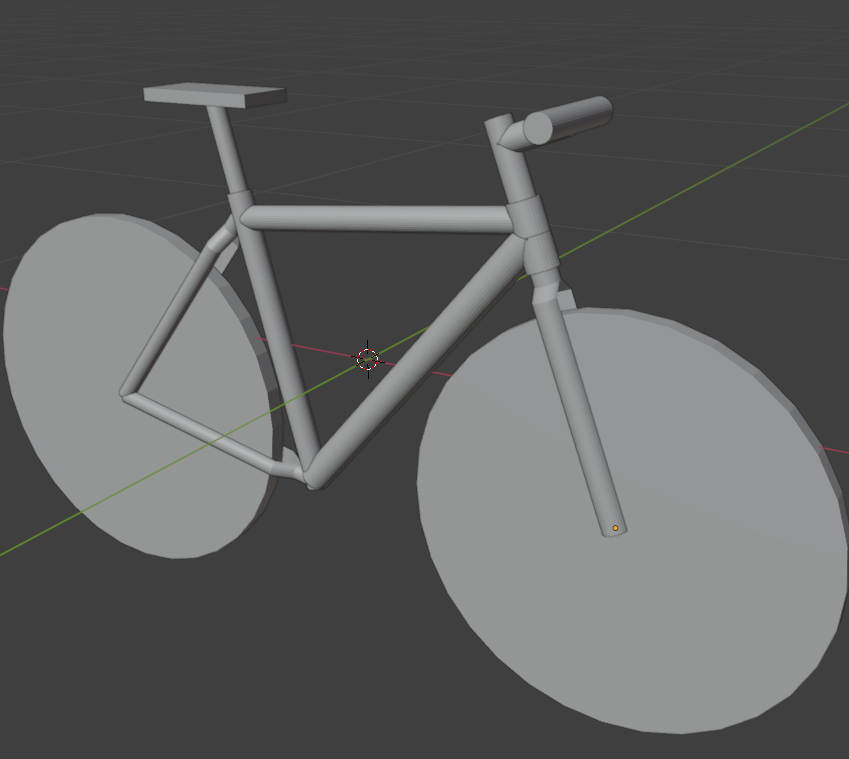
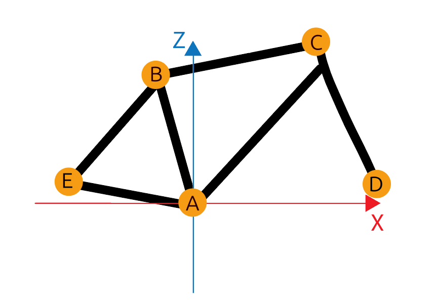

**The following are all of the notes for the Bike model**

## Process of Bike Creation
- [Research](#research)
- [Making the model](#making-the-model)
- [Setting the rig](#setting-the-rig)
- [Edit Script](#edit-script)
- Drivetrain Parts

### Research
- **Terminology on Anatomy and Geometry:** Finding the correct terms for every part and measurement of the bike was the first part of the research, which was found in a security oriented review and recommendation site for everything bicycle related called "Bike Lock WIKI" in their comprehensive diagram on bike parts [here](https://www.bikelockwiki.com/parts-of-a-bike-diagram/), the most important parts are shown in the picture below. The geometry side was much simpler, being able to be condensed into one reference image with any details needed explained thoroughly in the site "GeometryGeeks.bike" in [this page](https://geometrygeeks.bike/understanding-bike-geometry/).

*Bike parts found in [bikelockwiki.com](https://www.bikelockwiki.com)* 

- **Prototype Reference:** A reference was needed to make the base prototype for the bike to take form, it would later be customized so a temporary template was needed which was found in a [research paper](https://www.researchgate.net/publication/295675697_Multi-objective_optimization_of_an_on-road_bicycle_frame_by_uniform_design_and_compromise_programming) about bicycle frame optimization by uniform design and compromise programming. From that paper the example given in the form of a picture that is shown below was taken for the length and thickness of each bike part.

*Image taken from the [research paper](https://www.researchgate.net/figure/Basic-dimensions-of-on-road-bicycle-frame-model_fig2_295675697)* 

- **Finding the "important" parts:** In order for the bike to be customized to our liking the ability to bend the frame was needed, but in order to do that the editable measurements should be assigned prior to the design of the bike to make sure everything was in order. Through some research on the capabilities of the 3D modeling software that was used (Blender) and through consideration of the most vital parts of the bike, it was concluded that the minimum requirement of data needed were the following measurements:
 1. Seat Angle
 2. Seat Tube C-C
 3. Stack
 4. Reach
 5. Head Angle
 6. Head Tube
 7. Fork Length
 8. Rake/Offset
 9. Wheelbase
	More information on how they are used in the [Rig section](#setting-the-rig).

*Bike geometry found in [geometrygeeks.bike](https://geometrygeeks.bike)* 

- **Gathering Data:** A single prototype or example is not enough to make sure that the bike can be fully formed into our standards is not enough. So several examples were gathered through the site mentioned beforehand: [geometrygeeks.bike](https://geometrygeeks.bike/) and it's selection of bikes and their measurements. Another way examples were acquired was from personal research on the bikes of people that volunteered to either have their bikes measured or measure it themselves and record the results. (whoever did is credited in the **TO BE ADDED** either anonymously or named)

**MORE IS TO BE ADDED**
### Making the model
Aiming for simplicity at first the base prototype bike was made to have anything practical applied to it's generalized frame. This prototype was multiple cylinders, each of them being one of the six parts of the bike frame as seen below. They were aligned and measured by tracing them over the example taken from the research paper mentioned in the [[#Research]] section.

*Screenshot taken in Blender*

After making this standard frame, the parts that would be holding the back tire were split in half to accommodate the wheels while making sure to not have a hollow half-cylinder, completing the frame. Following that the Fork of the bike was created and split to be able to hold the front wheel. Having the all the needed parts for it the wheels, seat and handle were also added to bike making it although simple, complete and fully functional for the editing process.

*Screenshot taken in Blender*

### Setting the rig
#### Rig Explanation
The key points where condensed into 5 points in the 3D environment, for simplicity the Y axis will be 0 and any action will be done in the Z and X axis, the height and length of the bike respectively:
- A: BB point (where the axle is) 
- B: End of Seat Tube C-C measurement
- C: Top of the Head Tube
- D: Front Tire
- E: Back Tire

*Image created by my brother using Illustrator*

- **Point A:** Through the first point (A) which will always be set at the (0,0) mark, the B point can be found using the Seat Tube C-C and the Seat Angle measurements using the polar-to-Cartesian coordinate transformation equations. It is also possible to find the C point by adding the Stack measurement to the Z axis and the Reach measurement to the X axis.
- **Point B:** Knowing the location of the B point allows us to fully form the Seat Tube, which is needed to be the originator 4 main components of the bike, those being the Chain Stays, Seat Stays, Top Tube and Down Tube.
- **Point C:** This point is important because it will be the originator for the Heat Tube and Fork, it will act as a reference for the D point . Similarly to how the location for the second point (B), the polar-to-Cartesian coordinate transformation equations will be used using the measurements: Head Tube, Fork Length, Head Angle with some small corrections using the Rake/Offset.
- **Point D:** This point will help in placing the wheel and complete the whole front of the bike, that being anything from the Handle to the Fork, completing the Fork and giving us enough information to complete the rest, it will also help as a reference to find the final point, which will be done by subtracting the Wheelbase measurement from the X axis.
- **Point E:** The final point is needed to place the second wheel and complete the Seat Stays and Chain Stays

#### Constraints and Bone connection
The constraints will help the editing process by allowing certain behaviors of the parts while prohibiting unwanted distortion. The list of what constraints will be used and their use is as follows:
- **Limit Scale:** This forbids the mesh to be scaled in certain axis, for example it can limit the scale of the X axis to minimum=1 and maximum=1 making it unable to be scaled up or down in the X axis.
- **Stretch to:** This constrain is more of a guide, setting a point to which the item will stretch to to have it reach that point whatever happens to that guide object, this can of course lead to various unwanted distortion which is why it will always be paired with the "Limit Scale" constraint
- **Child of:** By setting one mesh to be the child of another it sets it to copy everything done to the parent, for example if the parent is moved 10 cm to the right, the child will do the same, the same is applied when scaling, rotating and most other actions.
- **Copy Location:** By having a mesh copy the location of another mesh, it will simply be at the same coordinates as the mesh it is set to, the points of reference that will be in the same place is always their individual origin points.
- **Copy Rotation:** Similarly to the "Copy Location" constraint it is possible to set a mesh to copy the exact rotation of a mesh in any axis.

Similarly the way the bones are connected is very important as it would be completely different if even one bone is reversed or altered. For example if there are 2 bones linked together in a line, having their components like this: Head of bone 1, Tail of bone 1 connected to Head of bone 2 and finally Tail of bone 2. If bone 1 is moved as a whole the head of bone 2 will follow, while its tail will stay the same, but if bone 2 is attempted to be moved, only it's tail will move because it is the "Child" of bone 1 and has less influence. Making it important to set the right bones are the parent bones and child bones.
#### Armatures
A total of 2 armatures were made, one for the frame of the bike and one for the fork and everything attached to it. As seen in the image below the bones highlighted in green make up the armature responsible for the frame and the gray bone is the separate armature for the rest. The armatures are named "AFrame" and "AFork" respectively.

*Screenshot taken in Blender*

#### Constraints and settings for each bone
**AFork:** The only bone in this is the Fork bone, making it unable to have a parent bone or child bone and needing only 3 simple constraints, these being **Copy Location** targeting at point C, **Stretch to** targeting point D practically making it start from C and end at D and **Limit Scale** to make it unable to become thinner or wider.

**AFrame:** For simplicity, for this section, each bone will be named after the part of the bike it represents:
- **Seat Tube:** As seen in the image it is the parent bone of every other bone having all of their heads pointing to it, this allows the seat tube to be transformed while having the rest follow it around. In order to edit it, the head point in set to **Copy Location** to point A and **Stretch to** point B while having the **Limit Scale** on X and Y axes to restrict it from widening or thinning.
- **Top Tube:** Being the child bone of the Seat Tube bone it's head will always follow the Seat Tubes tail, making it only need to **Stretch to** Point C (with some corrections) and **Limit Scale** for the same reasons as the Seat Tube.
- **Down Tube:** Very similar to Top Tube, it follows the Seat Tube's head so it only needs to **Stretch to** point C (again with some corrections) and for the same reasons have **Limit Scale** added.
- **Seat Stays:** Similarly it's head follows the tail end of the Seat Tube, only needing to **Stretch to** point E and **Limit Scale**.
- **Chain Stays:** Exactly the same as the Seat Stays but instead of following the tail end it follows the head end of the Seat Tube.

### Edit Script
#### Key parts of the script
- **Bpy library:** In order to edit the blender file with python the "bpy" library was used through the scripting section in Blender.
- **Data Acquisition:** Every measurement and angle needed for the bike is stored in a YML file created externally and later added into Blender's compiler.
- **Set_Point("name",X,Z) Function:** This function allows us to move any object to wherever needed. It takes 3 variables, these being the name of the object and the X,Z coordinates of the target location (Y axis wont change therefore is always 0), after that input it sets the coordinates for the target location, it selects the object, it moves it, and then deselects everything to avoid moving multiple objects.
- **Wheel Adjustments:** There is a point in the Script that will focus just on the tires and wheels of the bike to match the data given
- **Small corrections/Adjustments:** For the sake of the design there are some parts that need to be around a point and not on it, these will be moved last and will move according to the rest of the parts to ensure everything is where it should
- PENDING

**The process of editing is as follows:**
There is a function named "Set_Point()" which takes as input the name of the object and moves it to the location the X,Y and Z axis are currently leading, Y will stay at 0 while the X and Z axis will be modified as needed before running the function.
1. The data is read and adjusted in order to be ready for the calculations needed to place each part in it's correct place.
2. The X and Z axis are both appointed to the needed value for the point, in this case its the A point so X=0 and Z=0, then we run the function for the A point moving it to (0,0). This process is repeated for every major point.
3. Small adjustments are made during the first part, namely in the Head Tube parts and for the D point to account for the Rake/Offset.
4. Any part that isn't attached to the bike is moved to the right place, that includes the handle and the seat
5. The wheels will be transformed in any way needed.

Tire thickness, radius change angles to rads
**NOT FINISHED REFINEMENT OF THE BIKE PENDING**

## Bibliography
### References
- https://www.bikelockwiki.com/parts-of-a-bike-diagram/ (part names)
- https://www.researchgate.net/publication/295675697_Multi-objective_optimization_of_an_on-road_bicycle_frame_by_uniform_design_and_compromise_programming (other thesis on bike frames)
- https://geometrygeeks.bike/understanding-bike-geometry/ (general geometry)
- https://www.bikeradar.com/advice/buyers-guides/rim-width-explained-for-road-bikes-mountain-bikes-and-gravel-bikes (tire rim details)
## Glossary

**VERY SCRAPPY STILL**
**Armature:** 
**Bones:** Components creating an armature being able to be linked to meshes to be transformed in the same way as the bone relative to other bones in the armature. 
**Bone Head:** 
**Bone Tail:** 
**Mesh:** 

Each bone has a head and a tail, the head being the start of the bone being represented by the thicker side and the tail leading to the end of the bone. The head of the bone is always set to it's parent bone on the assigned end of it, meaning wherever that end goes the bone follows. The tail is able to be moved freely without affecting the structure of anything, unless it has a bone's head attached to it.
