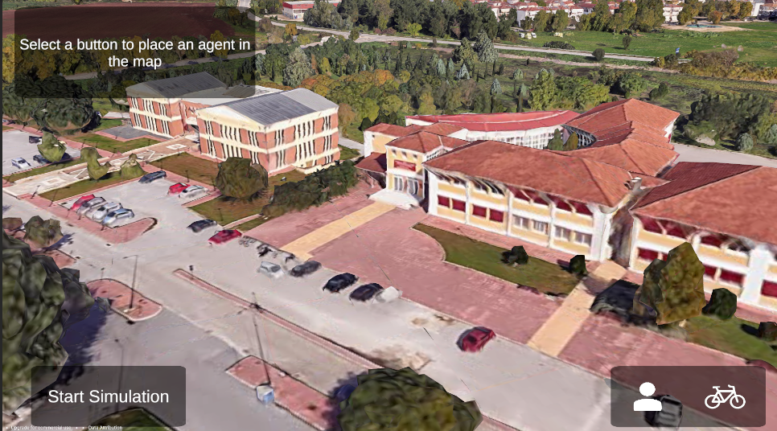

# Unity-based Simulation of Active Transport in Built Environment

## 📝 Project Overview
Active mobility (cycling and walking) is a cornerstone of sustainable urban planning, yet real-world testing is often restricted by costs and safety risks. This thesis presents a **Unity-based simulation application** that bridges the gap between geospatial data and behavioral analysis.

The framework provides an end-to-end pipeline—from **Google 3D Maps** to **interactive 3D scenarios**—allowing researchers to visualize and test mobility patterns in high-fidelity built environments.

---

## 🚀 Key Features
* 🌍 **Geospatial Integration:** Converts Google Photorealistic 3D Tiles into Unity meshes via **Cesium**.
* 🚲 **Parametric Modeling:** Automated generation of bicycle and rider assets using **YAML-driven Blender scripts**.
* 🤖 **Intelligent Agents:** Dynamic pathfinding and mixed-mobility behavior using **Unity NavMesh**.
* 🎥 **Research-Ready Tools:** Interactive simulation controls and **Cinemachine** camera systems for immersive observation.
* 📍 **Case Study:** Fully realized simulation of the **Gaiopolis Campus (Larissa, Greece)**.

---

## 🛠️ Technical Pipeline
The workflow follows a 6-step integration process:

1.  **Data Extraction:** Retrieve map data from **Google 3D Maps API**.
2.  **Environment Setup:** Use **Cesium for Unity** to generate 3D tilesets.
3.  **Specification:** Define bicycle/rider properties (dimensions, materials) in **YAML**.
4.  **Asset Generation:** Procedural modeling in **Blender** based on the YAML specs.
5.  **Integration:** Combine geospatial meshes and parametric assets within **Unity**.
6.  **Simulation:** Execute movement logic, pathfinding, and mobility analysis.

## 📖 Abstract / Περίληψη

<b>English Abstract (Expand)</b>

Active mobility within urban environments has become increasingly crucial for public health and sustainable transportation systems. While significant efforts focus on infrastructure development—such as bicycle lanes and pedestrian pathways—research into mobility patterns and behavioral analysis remains essential for evidence-based urban planning. This thesis presents a comprehensive simulation application designed to facilitate research and visualization of active mobility scenarios in built environments. The application serves dual purposes: providing researchers with sophisticated analytical tools for conducting case studies, while maintaining accessibility for stakeholders with varying technical expertise. Through intuitive visualization and interactive demonstration capabilities, the platform enables effective communication of research findings and supports informed decision-making in urban mobility planning.

<b>Ελληνική Περίληψη (Ανάπτυξη)</b>

Η ενεργή κινητικότητα στα αστικά περιβάλλοντα έχει καταστεί ολοένα και πιο καθοριστική για τη δημόσια υγεία και τα βιώσιμα συστήματα μεταφοράς. Ενώ σημαντικές προσπάθειες εστιάζουν στην ανάπτυξη υποδομών—όπως ποδηλατόδρομοι και πεζόδρομοι—η έρευνα σχετικά με τα πρότυπα κινητικότητας και την ανάλυση συμπεριφοράς παραμένει ουσιώδης για τον τεκμηριωμένο αστικό σχεδιασμό. Η παρούσα διπλωματική εργασία παρουσιάζει μια ολοκληρωμένη εφαρμογή προσομοίωσης που σχεδιάστηκε για να διευκολύνει την έρευνα και την οπτικοποίηση σεναρίων ενεργής κινητικότητας σε δομημένα περιβάλλοντα. Μέσω διαισθητικής οπτικοποίησης και διαδραστικών δυνατοτήτων επίδειξης, η πλατφόρμα επιτρέπει την αποτελεσματική επικοινωνία των ερευνητικών ευρημάτων και υποστηρίζει τη λήψη τεκμηριωμένων αποφάσεων στον σχεδιασμό αστικής κινητικότητας.

