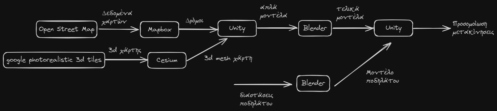

#### Pipeline Stages

1. **Data Acquisition**  
   - **Open Street Map**: Provides basic **geospatial data** (maps) of the environment, including roads and structural layouts.
   - **Google Photorealistic 3D Tiles**: Supplies high-resolution, photorealistic **3D tiles** for detailed urban modeling.

2. **Environment Setup and API Integration with Cesium and Mapbox**  
   - **Cesium**: Converts Google Photorealistic 3D Tiles into **3D mesh maps** that can be used in Unity, providing high-detail models of the urban landscape.
   - **Mapbox**: Integrates Open Street Map data into Unity, adding simplified representations of roads.
   - **Purpose**: Together, Cesium and Mapbox enable **data integration** and **environment setup** within Unity, providing APIs and essential 3D components to establish the simulation environment.

3. **Initial Unity Import**  
   - **Process**: The components and 3D mesh maps from Cesium and Mapbox are imported into Unity, forming the base environment with road and map data.
   - **Output**: This initial setup is exported to **Blender** for detailed refinement.

4. **Model Refinement in Blender**  
   - **Function**: Blender is used to **enhance** the initial Unity models, adding finer details to buildings, roads, and other structures.
   - **Additional Models**: A **bicycle model** is created in Blender to support accurate movement simulation.
   - **Output**: The finalized environment and bicycle models are exported back to Unity.

5. **Final Unity Import and Simulation**  
   - **Process**: The refined models from Blender are integrated back into Unity, completing the environment setup.
   - **Simulation**: Unity simulates **bicycle movement** within the detailed environment