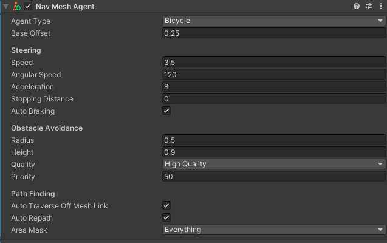
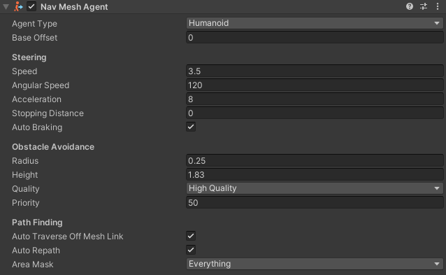

## NavMesh Agent: The Bike

In this project, the bicycle serves as the primary NavMesh Agent, navigating the environment generated from real-world geospatial data. By leveraging Unity’s NavMesh system, the bike can move across the terrain, avoiding obstacles and following predefined paths or dynamically calculated routes. 

 
To ensure the bicycle behaves realistically within the simulation, the **NavMesh Agent** component is configured with specific parameters. These settings, as shown in the Unity inspector, define the bike's navigation and movement characteristics:  

- **Base Offset**: Set to `0.25`, ensuring the bike's position relative to the NavMesh aligns properly with the 3D mesh.  
- **Steering**:  
  - **Speed**: Defined at `3.5`, which represents the maximum movement speed of the bike in Unity units.  
  - **Angular Speed**: Set to `120`, allowing the bike to make smooth turns without sharp or unrealistic changes in direction.  
  - **Acceleration**: Configured at `8`, enabling the bike to gradually reach its maximum speed.  
  - **Stopping Distance**: Set to `0`, ensuring precise stopping behavior when reaching a target.  
  - **Auto Braking**: Enabled for smoother deceleration when navigating around obstacles.  
- **Obstacle Avoidance**:  
  - **Radius**: Set to `0.5`, defining the bike's collision boundary when avoiding obstacles.  
  - **Height**: Set to `0.9`, matching the bike's vertical space requirements.  
  - **Quality**: Configured to "High Quality" to prioritize accuracy in obstacle avoidance calculations.  
  - **Priority**: Assigned a value of `50`, indicating the agent's importance when resolving navigation conflicts.  
- **Pathfinding**:  
  - **Auto Traverse Off Mesh Link**: Enabled, allowing the bike to navigate over gaps or connections in the NavMesh.  
  - **Auto Repath**: Enabled, ensuring the bike recalculates its path dynamically if the route becomes blocked.  
  - **Area Mask**: Set to "Everything," allowing the bike to traverse all walkable areas defined by the NavMesh.  

## NavMesh Agent: The Humans  

In addition to the bicycle, humans are introduced as NavMesh Agents within the simulation to replicate pedestrian behavior and interactions with the environment. These agents represent individuals navigating the same terrain as the bike, providing an opportunity to study mixed mobility scenarios. 

The human NavMesh Agents are configured to replicate realistic pedestrian behavior within the simulation. The settings, as shown in the Unity Inspector, are adjusted to reflect the unique movement characteristics of humans:  

- **Base Offset**: Set to `0`, ensuring the agent aligns directly with the NavMesh surface.  
- **Steering**:  
  - **Speed**: Configured at `3.5`, representing the typical walking speed of a human in Unity units.  
  - **Angular Speed**: Set to `120`, enabling humans to turn smoothly and naturally.  
  - **Acceleration**: Defined as `8`, allowing agents to gradually reach their walking speed.  
  - **Stopping Distance**: Set to `0`, ensuring accurate stopping behavior when reaching destinations.  
  - **Auto Braking**: Enabled to allow smooth deceleration when obstacles are detected.  
- **Obstacle Avoidance**:  
  - **Radius**: Set to `0.25`, which defines a smaller collision boundary suitable for human agents.  
  - **Height**: Adjusted to `1.83`, corresponding to the average height of a human.  
  - **Quality**: Configured to "High Quality" for accurate obstacle avoidance.  
  - **Priority**: Set to `50`, indicating the relative importance of the human agents in navigation resolution.  
- **Pathfinding**:  
  - **Auto Traverse Off Mesh Link**: Enabled, allowing humans to navigate connections between separate areas of the NavMesh.  
  - **Auto Repath**: Enabled to ensure humans dynamically adjust their paths when the current route is blocked.  
  - **Area Mask**: Set to "Everything," enabling traversal across all defined walkable areas.  

