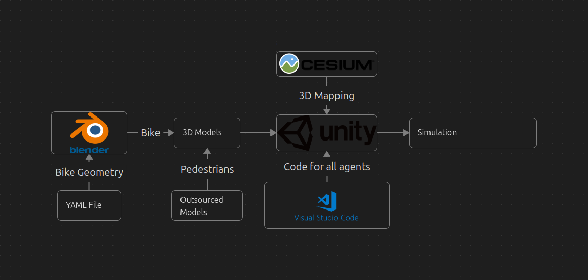

# Pipeline

1. **Google 3D Maps**  
   - Retrieve map data from Google 3D Maps for the target location.

2. **Cesium**  
   - Use Cesium to convert the map data into a 3D mesh compatible with Unity.

3. **YAML File**  
   - Define bicycle properties (e.g., dimensions, material) in the YAML file to ensure accurate modeling in Blender.

4. **Blender**  
   - Import a bicycle 3D model and configure its properties based on the specifications provided in the YAML file.

5. **Unity**  
   - Integrate the 3D map from Cesium and the bicycle model from Blender into Unity.
   - Use Unity to simulate the environment and interactions.

6. **Simulation**  
   - Run the simulation in Unity to test and analyze movement mobility.

